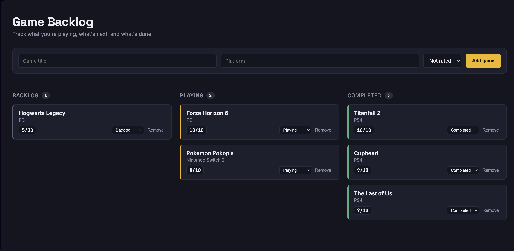

# Game Backlog API

A REST API built with ASP.NET Core and Entity Framework Core, backed by SQL Server, to track a personal game backlog (games to play, in progress, and completed).

## Screenshot

## Tech stack
- C# / ASP.NET Core (.NET 10) 
- Entity Framework Core
- SQL Server (via Docker / Azure SQL Edge on Apple Silicon)

## Features
- Full CRUD via REST endpoints (`GET`, `POST`, `PUT`, `DELETE`)
- Code-first database schema with EF Core migrations
- Dependency injection for database context

## Endpoints
| Method | Route              | Description          |
|--------|--------------------|-----------------------|
| GET    | /api/games         | List all games        |
| GET    | /api/games/{id}    | Get a single game      |
| POST   | /api/games         | Create a new game      |
| PUT    | /api/games/{id}    | Update a game          |
| DELETE | /api/games/{id}    | Delete a game          |

## Running locally

1. Start SQL Server in Docker:

docker run -e ACCEPT_EULA=1 -e MSSQL_SA_PASSWORD='YourPassword123!' -p 1433:1433 --name sql-edge -d mcr.microsoft.com/azure-sql-edge

2. Copy `appsettings.Example.json` to `appsettings.json` and set your own password.
3. Apply migrations:

dotnet ef database update

4. Run the API: 

dotnet.run
